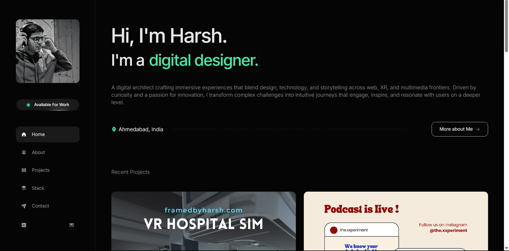

# DESIGN.md: Framed by Harsh

## Source
- URL: https://framedbyharsh.framer.ai/
- Capture date: 2026-07-21
- Evidence: saved HTML for `/`, `/about`, `/projects`, `/stack`, `/projects/3d-web-portfolio`, `/projects/north-website-design-ui-ux`, `/projects/vr-hospital-simulation`; Framer-hosted image assets downloaded into `public/assets`.

## Reference Screenshot

Use this screenshot as the visual source of truth for layout, hierarchy, density, and feel.

## Design Summary
Dark portfolio interface with a fixed left rail on desktop, black canvas, large clean type, muted gray body copy, dotted divider lines, rounded image cards, and a bright mint-green accent for availability, location, and designer emphasis. Tablet and mobile collapse the navigation into a top icon bar while preserving the same content order and dark visual language.

## Design Tokens

### Colors
- Background: `#030303` / `#050505`
- Panel: `#151515` / `#191919`
- Border: `#242424` / `#272727`
- Text: `#f4f4f4`
- Muted text: `#9a9a9a`
- Accent green: `#43f0a5`
- Light project surface: `#eee5d6`

### Typography
- Primary: Inter Tight, Inter, system sans-serif.
- Mono details: Fragment Mono.
- Custom display asset observed: `valorax Regular` from Framer.
- Hero scale: 76px desktop, 58px tablet, 43px mobile.
- Body: 21-22px desktop, 18-20px mobile, tight line-height around 1.3-1.5.

### Spacing And Layout
- Desktop rail: 360px fixed left, 72px top padding, 59px side padding.
- Main content: left margin 360px, 78px horizontal padding.
- Cards: 11-14px radius, 1px dark border.
- Section rhythm: generous vertical gaps, 90-110px between major page blocks.

## Components
- Left rail with grayscale portrait, availability pill, vertical nav, LinkedIn/mail icons.
- Availability pill: dark rounded capsule, green live dot with outer glow.
- Nav items: 60px high rounded rows, active item uses dark panel fill and white label.
- Outline buttons: 1px white border, 14px radius, arrow icon, white hover fill.
- Project cards: image background, dark overlay, mono category label, large white title.
- Stack cards: dark bordered cards with square logo area, title, subtitle, dotted divider, description.
- Case studies: back link, large title, pill metadata, wide hero image, centered article body.
- Footer/contact block: logo/image, status pill, descriptive copy, oversized "Let's Talk!" CTA.

## Page Patterns
- Home: hero intro, location row, recent projects, stack preview, contact footer.
- About: portrait/intro, experience timeline, stack copy block, education timeline, contact footer.
- Projects: page title and project grid.
- Stack: page title and full tool grid.
- Project detail pages: title, metadata, hero media, narrative sections, back links, related projects.

## Content Style
Concise first-person portfolio voice. Headings are direct and personal. Supporting copy emphasizes immersive digital experiences, XR, UI/UX, storytelling, and technical craft.

## Agent Build Instructions
Build the actual app as the first screen, not a landing page. Preserve the black UI, desktop left rail, mobile top nav, large hero type, mint accent, dotted line dividers, rounded cards, and Framer-hosted imagery. Use reusable route data for projects and stack items so the pages stay consistent.

## Rerun Inputs
workflow: firecrawl-website-design-clone
source_url: https://framedbyharsh.framer.ai/
target_stack: React + Vite
output: DESIGN.md and React implementation
